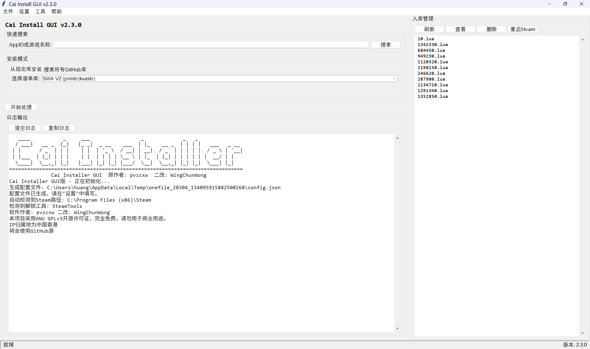

# Cai Installer GUI



本项目是基于 [pvzcxw/cixGUI](https://github.com/pvzcxw/cixGUI) 的二次开发版本。原项目因维护精力有限已停止更新，本改版旨在继续维护该工具，修复已知问题并增加新功能，为用户提供更稳定的使用体验。

## 原项目说明

原项目 `Cai Installer Gui` 是一款用于游戏安装相关的GUI工具，因原作者需专注于 `cixWeb UI` 开发，已于此前宣布停止对 `cixGUI` 的维护。原作者开放了全部源码（基于 GPL3.0 协议），鼓励社区继续开发迭代。

详情可参考原项目声明：[停更通知](https://github.com/pvzcxw/cixGUI)

## 二改版特性

- **继承原项目核心功能**：保持与原版本的兼容性，支持 SteamTools 和 GreenLuma 两种解锁工具。
- **智能搜索**：支持按游戏名称或 AppID 搜索，自动匹配并选择最新清单。
- **自动更新检测**：启动时自动检查新版本，支持国内镜像加速下载。
- **地理位置感知**：自动检测用户所在地区，智能选择 GitHub 源或国内镜像源。
- **图形化界面**：使用 tkinter 构建，界面友好，操作简便。
- **入库管理**：内置文件管理面板，可查看、编辑、删除已入库的 Lua 脚本。
- **配置灵活**：支持自定义 Steam 路径、GitHub Personal Token、自动重启 Steam 等选项。

## 安装与使用

### 环境要求

- Windows 10+
- Python 3.8+
- Steam 客户端
- SteamTools 或 GreenLuma

### 下载
在[Release](https://github.com/WingChunWong/Cai-Installer-Gui/releases/latest)下载

### 使用方法

1. **启动程序**：运行 `Cai-Installer-Gui.exe`，主界面将显示。
2. **搜索游戏**：在“快速搜索”框中输入游戏名称或 AppID，点击“搜索”按钮。
3. **选择安装模式**：
   - **从指定库安装**：在选项卡中选择一个清单库（如 SWA V2、Walftech 等）。
   - **搜索所有 GitHub 库**：自动搜索所有已知 GitHub 仓库，并选择最新的清单。
4. **开始处理**：点击“开始处理”按钮，程序将自动下载清单、密钥并生成解锁脚本。
5. **重启 Steam**：处理完成后，程序会根据设置自动重启 Steam（或提示手动重启）。
6. **入库管理**：右侧面板可查看已入库的 Lua 文件，支持查看、删除等操作。

### 配置说明

程序首次运行会在同级目录生成 `config.json` 配置文件，您可以通过菜单栏“设置”→“编辑配置”进行修改：

- **GitHub Personal Token**：用于提高 API 请求限额。
- **自定义 Steam 路径**：若自动检测失败，可手动指定 Steam 安装目录。
- **SteamTools 自动更新模式**：启用后，清单版本将浮动更新（不锁定特定版本）。
- **入库后自动重启 Steam**：处理完成后是否自动重启 Steam。

## 常见问题

### 1. 无法检测到 Steam 路径
- 请确保 Steam 已安装，或手动在设置中指定 Steam 安装目录。

### 2. 下载清单失败
- 检查网络连接，若在国内可尝试启用“使用镜像”选项（程序会自动检测）。
- 若使用 GitHub 源，可配置 Personal Token 以提高成功率。

### 3. 解锁工具冲突
- 若同时检测到 SteamTools 和 GreenLuma，程序会提示冲突，请卸载其中一个。

### 4. 更新失败
- 更新下载可能因网络问题失败，可手动从 [Releases](https://github.com/WingChunWong/Cai-Installer-GUI/releases) 页面下载最新版本。

## 项目结构

```
Cai-Installer-GUI/
├── frontend_gui.py          # 主界面程序
├── backend_gui.py           # 后端处理逻辑
├── version.py               # 版本信息
├── requirements.txt         # Python 依赖
├── LICENSE                  # GPLv3 许可证
├── README.md                # 本文档
├── .gitignore
├── scripts/
│   └── generate_changelog.py # 自动生成变更日志脚本
└── imgs/
    └── image.png            # 项目截图
```

## 开发与贡献

欢迎提交 Issue 或 Pull Request 参与项目改进。

### 版本发布

版本号遵循语义化版本（SemVer），发布流程包括：
1. 更新 `version.py` 中的 `__version__`
2. 使用 `scripts/generate_changelog.py` 生成变更日志
3. 创建 Git 标签并推送
4. 在 GitHub Releases 中发布

## 许可证

本项目基于原项目的 GPL3.0 协议进行二次开发，遵循相同许可证条款。详情请参阅 [LICENSE](LICENSE) 文件。

> [!NOTE]
> 您可以自由复制、修改和分发本项目，但必须保留原作者信息及许可证声明，并确保衍生作品同样遵循 GPL3.0 协议。

## 致谢

- 特别感谢原项目作者 `pvzcxw` 开源 `cixGUI` 源码，为本改版提供了基础。
- 感谢 DeepSeek、ChatGPT、豆包等 AI 工具在开发过程中提供的辅助支持。
- 感谢所有清单库的维护者及社区贡献者。
